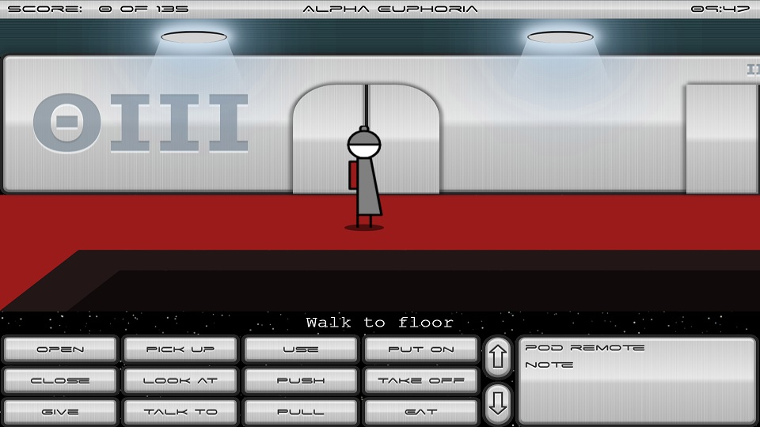
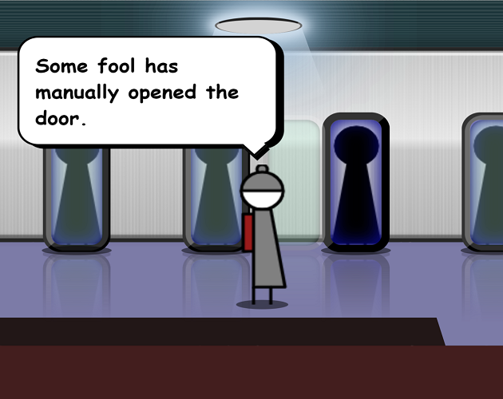
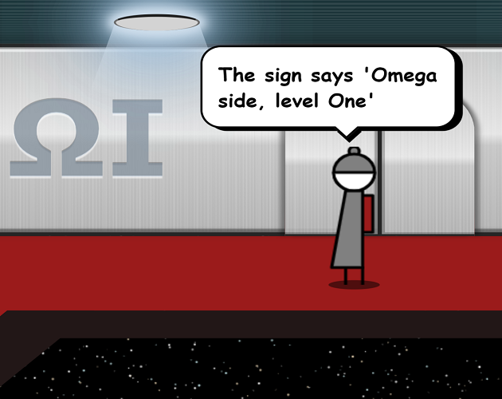
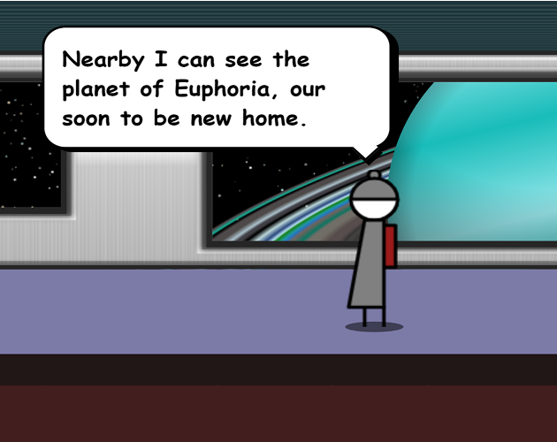
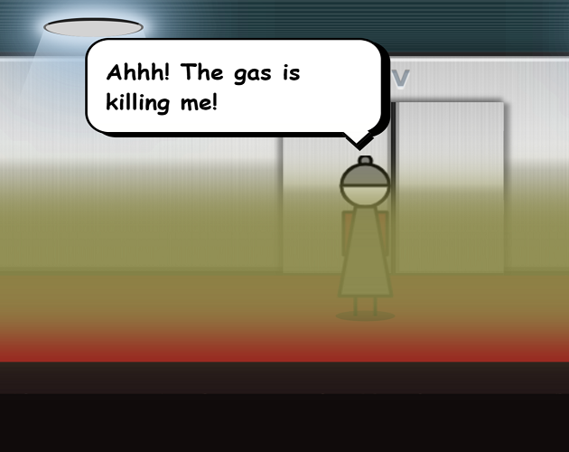

# Alpha Euphoria
Alpha Euphoria is a futuristic sci-fi animated adventure game written for the [2020 gamedev.js contest](https://lanceewing.itch.io/alpha-euphoria). 

You are Pip Wilco, maintenance engineer aboard the Alpha Euphoria, a deep space colonisation space ship heading for the beautiful world of Euphoria. Awakened from 100 years of cryosleep, you discover that only you have been awakened due to a fault in the ship systems. The Alpha Euphoria has sustained damage from asteroids and you must fix the maintenance problems before waking the rest of your crew. You only have 10 minutes before total system failure and ship disintegration. Good luck!

# How to Play

This game is a point and click animated adventure game. It uses an interface that is very similar to Lucasfilm adventure games, such as Maniac Mansion, Monkey Island, and Day of the Tentacle. Simply tell Pip what to do by building up a sentence, for example, "Walk to door", "Open cupboard", "Look at note". The box down in the lower right corner is your inventory.

For best results, use the latest release of Chrome. Some of the CSS effects do not work so well in Firefox, and even worse in older Edge versions. The latest "Blink" builds of Edge will be better. The game works well in Chrome on mobile.

# Screenshots

           |  
:-------------------------:|:-------------------------:
  |  

# Development
This game was built in plain Javascript, CSS and HTML. It was not built using a game development system. Part of the reason for building it in this way was to learn more about various CSS techniques, such as animation, transitions, transforms and filters. I've always been a big fan of 3D animated adventure games, so it is an attempt to create such a game in the browser using primarily vanilla Javascript and CSS3, only minimal HTML5 canvas for certain background effects, and no image files at all.

Another goal for this project was as a demo of using the doomjs opl3 JS library. I had some old Adlib ROL files I composed in the Adlib Visual Composer years ago that I wanted to use as background music for this game. Rather than pre-generate an MP3 file to play in the background, I decided that I wanted to see if I could generate it in the background in realtime from the ROL file. I found doom.js's opl3 library, but it did not support the Adlib ROL music format. So part of this project was to create a ROL file handler for the doomjs/opl3 library. The background music in Alpha Euphoria is an example of using the ROL format handler I wrote to play one of my ROL files.

# Main Credits

**Game Created By:** Lance Ewing

**Original Background Music Composed By:** Lance Ewing

**Sound Effect Library:** [JSFXR](https://github.com/mneubrand/jsfxr) by Markus Neubrand

**Music Synthesis Library:** [doomjs/opl3](https://github.com/doomjs/opl3) by DOOM.js

**Adlib ROL Format Handler (for doomjs/opl3):** by Lance Ewing

**Space Age:** [font](http://mickeyavenue.com/fonts/spaceage/) by Justin Callaghan

# Codepen Credits
This game uses, and indeed showcases, techniques from the following pens:

**"Brushed Metal"** [pen](https://codepen.io/simurai/pen/DwJdq) by Simon Lüthi (@simurai)

**"Shake"** [pen](https://codepen.io/sdras/pen/aOgMON) by Sarah Drasner (@sdras)

**"Elevator Grid"** [pen](https://codepen.io/rafaelcastrocouto/pen/xbKzrx) by Rafael Castrocouto (@rafaelcastrocouto)

**"E for Elevator"** [pen](https://codepen.io/maximerabot/pen/gbWmqJ) by Maxime Rabot (@maximerabot)

**"Saturn"** [pen](https://codepen.io/Davide_sd/pen/zhAxB) designed by Davide Sandonà (@Davide_sd)

**"Simple canvas star field"** [pen](https://codepen.io/iblamefish/pen/xgefG) by Clinton Montague (@iblamefish)

Thank you very much to the authors of those pens, particularly to Simon "simurai" for the "Brushed Metal" technique that is used extensively within the game, such as for the status bar at the top, the command buttons and inventory at the bottom of the screen, and even within the game rooms for the spaceship walls and elevator buttons. I think it adds very much to the spaceship aesthetic, so I applied it liberally.

# Other Credits
For drawing the ceiling lights with a beam of light coming down, the game makes use of the technique that James Butler describes in the following stackoverflow answer:

[CSS light (fading) effect](https://stackoverflow.com/questions/42672519/css-light-fading-effect#answer-42673277)
